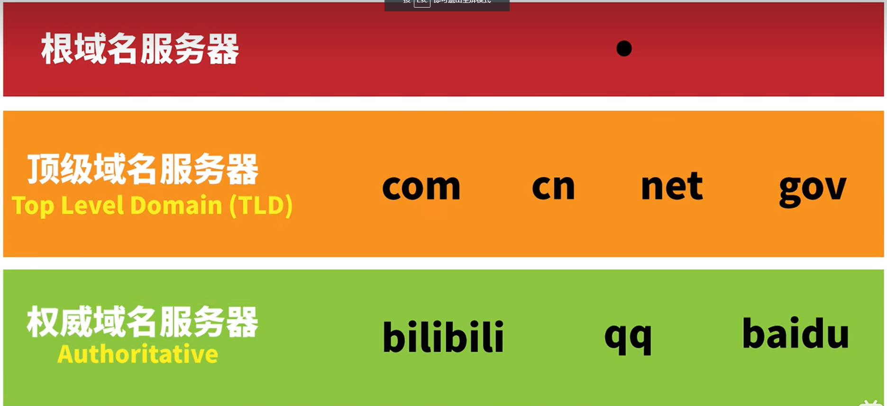
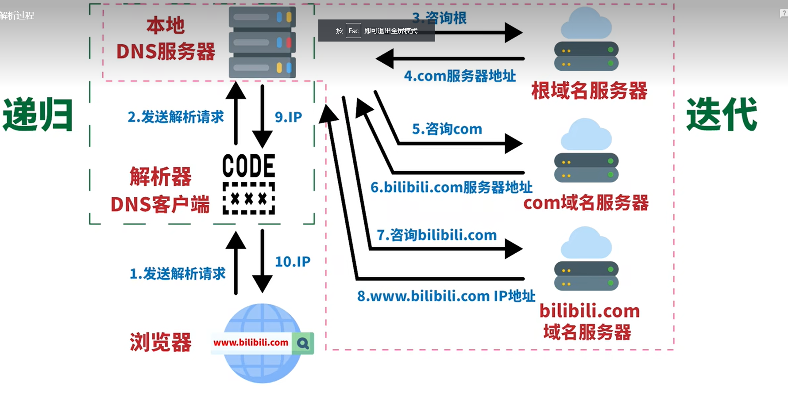
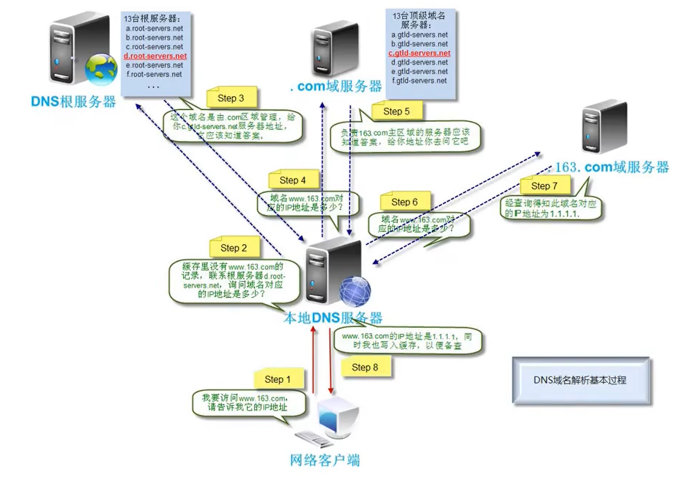
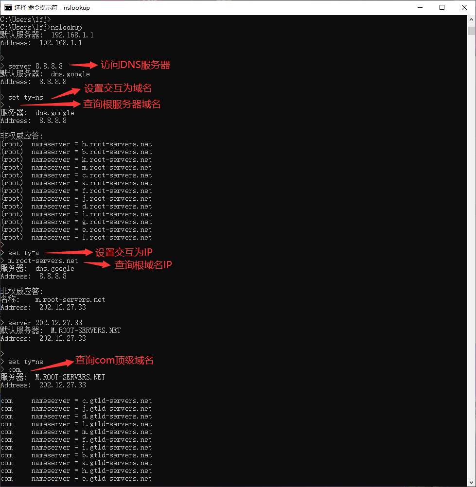
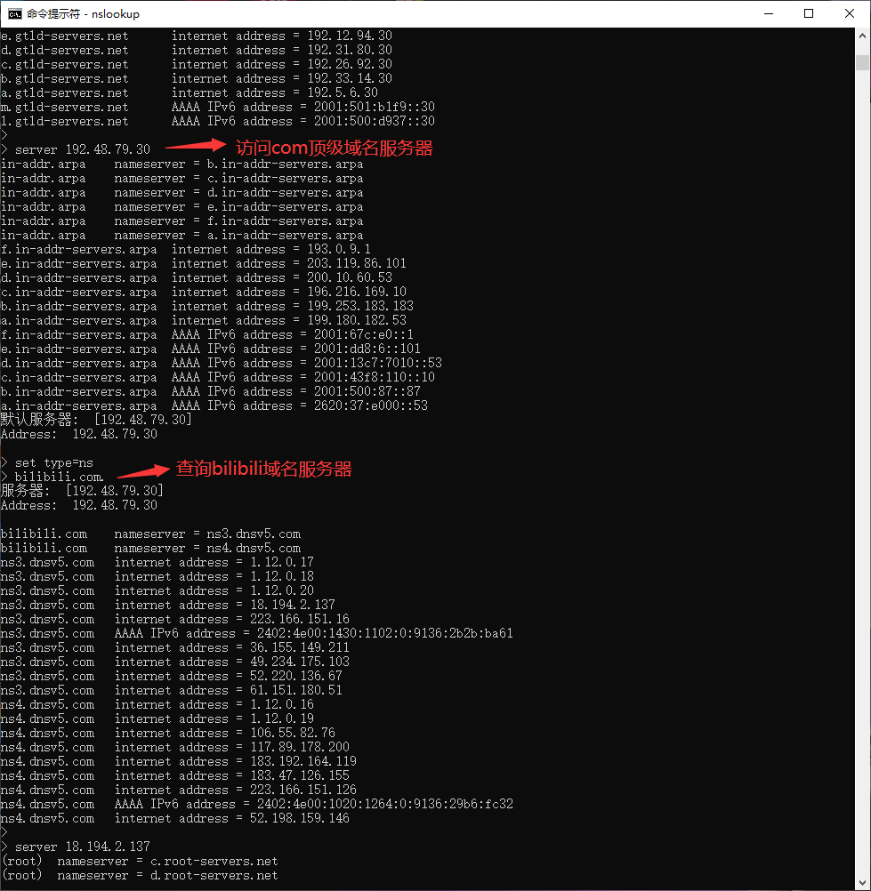
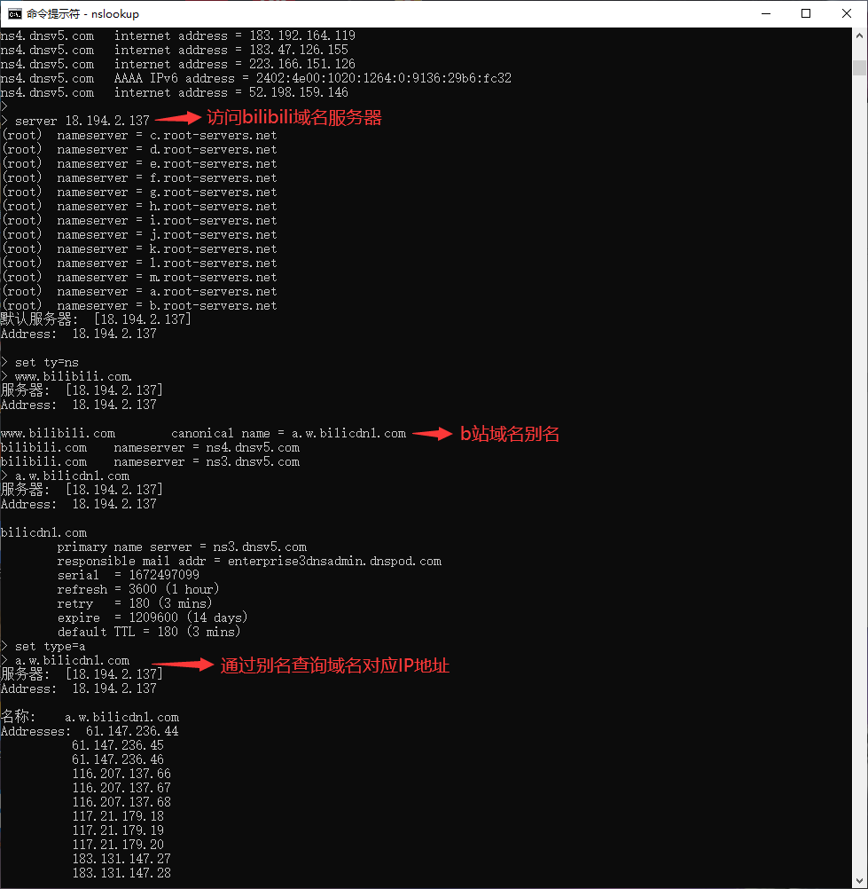

## 3.2信息收集-DNS

### 3.2.1 域名解析原理

#### 3.2.1.1、DNS服务器概述

运行DNS服务器程序的计算机，存储DNS数据库信息。DNS服务器分为 根域DNS服务器、顶级域名DNS服务器。根DNS服务器 存储 顶级域名服务器所在址；顶级域名服务器 存储 网站主机地址。

ipv4根域服务器全球共13台根服务器，唯一主根部署在美国，其余13台辅根有9台在美国，2台在欧洲，1台在日本。

#### 3.2.1.2、域名记录：A，Cname，NS，MX、PTR

（1）A记录（Address）正向解析

A记录是将一个主机名（全程域名FQDN）和一个IP地址关联起来。 这也是大多数客户端程序默认的查询类型。例：xuedong.cn->8.8.8.6

（2）PTR记录（Pointer）反向解析

PTR记录是将一个IP地址对应到主机名（全程域名FQDN）。这些记录保存在in-addr.arpa域中。

（3）CNAME记录（Canonical Name）别名

别名记录，也称为规范名字（Canonical Name）。这种记录允许您将多个名字映射到同一台计算机。

例：www.xuegod.cn 对应IP8.8.8.6，www.xuegod001.cn 对应IP8.8.8.6

（4） MX记录（Mail eXchange）

MX记录是邮件交换记录，他指向一个邮件服务器，用于电子邮件系统发邮件时根据 收信人的地址后缀来定位邮件服务器。

例：mail.xuegod.cn

当有多个MX记录（即有多个邮件服务器）时，则需要设置数值来确定其优先级。通过设置优先级数字来指明首选服务器，数字越小表示优先级越高。

(5)NS记录（Name Server）

NS（Name Server）记录是域名服务器记录，也称为授权服务器，用来指定该域名由那个DNS服务器来进行解析

#### 3.2.1.3、DNS缓存服务器

缓存DNS服务器：不负责解析域，只是缓存域名解析结果

DNS查询发实：递归查询和迭代查询

#### 3.2.1.4、DNS解析过程详解

（1）域名层级结构

www、mail、member、space为主机名

（2）域名服务器分类

①根域名服务器

最高层次的域名服务器(就好像国家总理一样)，也是最重要的域名服务器，全球只有13个根域名服务器。

②顶级域名服务器

就好像国家总理下面的各个省长，管辖省级单位。在DNS中，它们负责管理在该顶级域名服务器注册的下一级域名(二级域名)。

③权威域名服务器

负责一个区的域名服务器，因此权威域名服务器通常是指顶级域名以下的管理二级、三级、四级等域名的服务器。

④本地域名服务器

这类服务器不属于上面的层次结构，当一个主机(个人电脑)发出DNS请求时，查询请求就被发送到本地域名服务器，本地域名服务器负责回答这个查询，或者代替主机向域名空间中不同层次的权威域名服务器查询，再把查询的结果返回给主机。

（3）dns解析过程

①dns解析过程举例1

https://www.bilibili.com/video/BV1uL4y1B7aE/?spm_id_from=333.788&vd_source=de5cea4608a528734d8900977841e2ab

②dns解析过程举例2

https://www.bilibili.com/video/BV1ut4y1376t?p=12&vd_source=de5cea4608a528734d8900977841e2ab

通过浏览器访问网页，浏览器先通过本地DNS缓存查询IP，若没有就访问本地DNS服务器，本地DNS服务器缓存若没有记录，就访问根服务器......

DNS本地缓存包括：浏览器缓存、系统缓存（hosts文件）、路由器缓存

本地DNS服务器：通常由运营商提供

#### 3.2.1.5、DNS服务器无缓存时，模拟域名解析过程

nslookup指令讲解：https://zhuanlan.zhihu.com/p/361451835

